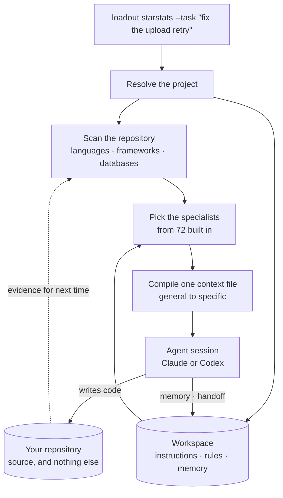
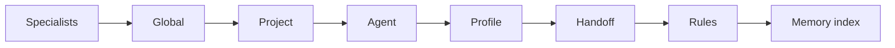
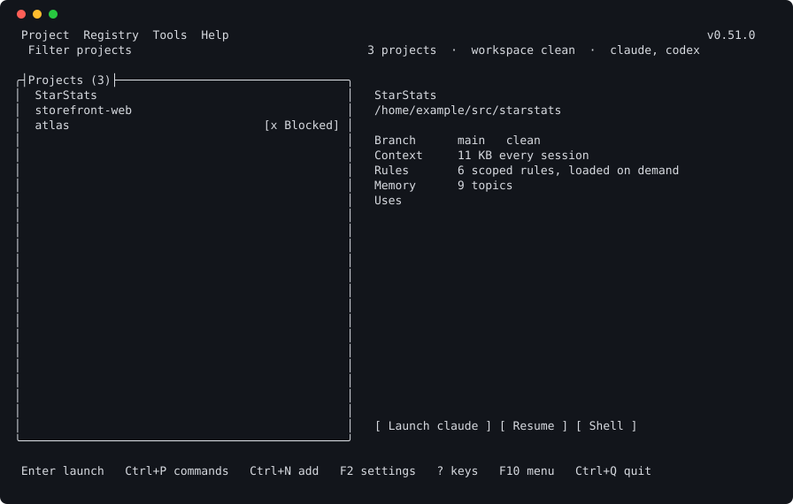

# Loadout

**One place for everything your AI agents need, so none of it ends up in your repo.**

[](https://github.com/ntatschner/loadout-cli/actions/workflows/ci.yml)
[](https://github.com/ntatschner/loadout-cli/releases/latest)
[](LICENSE)
[](https://github.com/ntatschner/loadout-cli/releases/latest)

Every coding agent wants to leave something in your repository. Instruction
files, a rules directory, MCP config, session state, notes it wrote to itself.
Each tool spells it differently, none of them clean up, and all of it turns up
in someone else's diff eventually.

Loadout keeps that stuff somewhere else. You get one workspace, a plain
directory or a Git repo if you want it versioned, holding the config, memory
and instructions for every project you work on. Your repository goes back to
being code.

It runs natively on Windows, Linux and macOS. No VM, no container, no "works
on Linux, should be fine elsewhere".

## What it does

| | |
| --- | --- |
| **Keeps agent files out of your repo** | One workspace holds instructions, rules and memory for every project. `protect`, `drift` and `migrate` keep it that way. |
| **Picks the instructions for the job** | 72 specialists built in. Loadout works out which apply from the repository and your task, and shows you why before anything launches. |
| **Remembers across sessions** | Durable facts per project, inlined as an index rather than in full, with compression and an audit that refuses credentials. |
| **A launcher, not just a CLI** | Full-screen terminal UI with a command palette reaching every command. Everything runs through the same parser you would have typed at. |
| **Lets the agent ask back** | A launched session can read a specialist, ask what it was given, and record a fact — over MCP or the CLI. Nothing that changes your machine. |
| **Counts what it cost** | Token accounting from the transcripts your agents already write, with cache reads priced properly. |
| **Undo** | File-changing commands preview first, take a snapshot, and restore. |

Every command takes `--json`, works from the CLI and the launcher, and the exit
codes don't move.

## Install

Grab your platform's archive from the
[latest release](https://github.com/ntatschner/loadout-cli/releases/latest).

### Linux and macOS

```sh
tar -xzf loadout-0.14.0-linux-x64.tar.gz
./install.sh          # goes to ~/.local/bin, no root
loadout setup
```

`install.sh` checks the SHA-256 first and won't install if it doesn't match.
There are `.deb` and `.rpm` packages if you'd rather.

### Windows

```powershell
msiexec /i loadout-0.14.0-win-x64.msi    # per-user, no elevation
loadout setup
```

That puts it in `%LOCALAPPDATA%\Programs\loadout`, adds it to your `PATH` and
makes a Start Menu entry. There's a plain `.zip` too.

[Installing](docs/installing.md) covers verification, system-wide installs and
the macOS Gatekeeper situation.

## Getting started

```sh
loadout setup                  # set up the workspace on this machine
loadout project add .          # register the repo you're standing in
loadout protect                # keep agent files out of it
loadout                        # launcher opens, pick a project, go
```

Run `loadout` with nothing after it and you get the terminal UI. `loadout here`
launches the agent for whatever repo you're in. `loadout <project>` skips
straight to a registered one.

## How it works



Two repositories, and the split is the whole idea. Your repository holds source.
The workspace holds everything the agent needs to work on it, so a teammate who
has never installed Loadout sees a clean diff.

The compiled context is assembled per launch into a directory only you can read,
and deleted when the agent exits. What goes into it, in order:



General first, narrowest last, so where two sources disagree the agent reads the
specific one last. `loadout instructions explain` prints the whole set with the
reason for each, before anything launches.

## What you get

### Instructions picked for the job

There are 72 specialists built into the binary: foundations, modes, languages,
frameworks, databases, platforms, clouds, functional areas and skills. Instead
of one enormous prompt that's mostly irrelevant, Loadout works out which ones
your task needs from the repo you're in and the words you used, then tells you
why it picked each one.

```console
$ loadout instructions explain "why is this postgres query so slow" --mode investigate

language
  + C#                     language.csharp        300 .cs files
framework
  + .NET                   framework.dotnet       Microsoft.Extensions. dependency declared
database
  + PostgreSQL             database.postgresql    task mentions "postgres"
function
  + Debugging              function.debugging     task mentions "why is"
  + Performance            function.performance   task mentions "slow"

Context
  Estimated instruction tokens: 2,403
  Budget: 12,000
  Usage: 20%

Where guidance overlaps
  C#: follow framework.dotnet over language.csharp (narrower scope composes last)
```

You can see the whole set, what it'll cost you in tokens, and where two
specialists disagree, before anything launches. If it picked something daft you
can rule it out with `--without`.

### Memory that doesn't grow forever

`loadout memory` keeps the durable facts about a project: decisions and why you
made them, constraints, the traps that keep catching people. The useful bit is
`memory compress`, which pulls facts out of always-loaded instruction files and
into the memory store. What every session pays for gets smaller; what it can
look up stays the same. `memory audit` goes looking for secrets, duplicates and
stale entries.

### Where the tokens went

```sh
loadout usage --days 7 --by day
```

No setup, no opt-in. It reads the transcripts your agents already write, so
there's history from the day you install it, including sessions from before.
Break it down by project, day, model or agent.

Cache reads are counted at their real rate rather than as fresh input, which
matters more than it sounds: on a long session the difference is most of the
number. If a total is incomplete it says so instead of quietly showing you a
smaller one.

There's also `loadout telemetry serve`, a local OTLP receiver for agents that
emit OpenTelemetry. Optional, and local means local: no service, no account,
nothing sent anywhere, counts only.

### Repos that stay clean

`loadout protect` sets up the Git protections. `loadout migrate` moves whatever
is already scattered around into the workspace, showing you the changes first
and taking a snapshot you can restore. `loadout drift` tells you when a project
has wandered from what you configured.

### A launcher, not just a command line



Run `loadout` with nothing after it. Every row says whether you can work on that
project, and the panel on the right says what a session would start with before
you spend one. `Ctrl+P` opens a palette over every command the CLI has, found by
what it is for: searching `undo` reaches `backup restore`, `broken` reaches
`doctor`.

The launcher never implements a command itself. Anything you pick runs through
the same parser you would have typed at, which is asserted by a test rather than
by intent.

### The agent can ask back

A launched session is told `loadout` is on PATH and offered the same operations
as MCP tools: read a specialist in full, ask what this session was given and
why, record one fact worth having next time.

Nothing that changes the machine or pushes to a remote is offered, and the
context says so rather than leaving the omission to be inferred. Ask an agent to
review a repository and it has a procedure for it — `skill.repository-review` —
and somewhere to put what it learns.

### Undo

Every file-changing command takes `--dry-run` and shows you the change first.
Anything that did change is in a snapshot:

```sh
loadout backup list
loadout backup restore 20260901-204044-fd3512
```

### Also in the box

Session listing and resume across agents, cross-agent handoff documents, MCP
servers managed per project, secrets in the OS credential store, context
profiles, project templates, editor integration, and a status line with project,
branch and context usage. `loadout doctor` checks the lot.

## Documentation

The detail lives in **[docs/](docs/README.md)**:

| Page | What's in it |
| --- | --- |
| [Recipes](docs/recipes.md) | Worked answers to the common jobs, with the commands |
| [Installing](docs/installing.md) | Packages, verification, building your own, updating |
| [First run](docs/first-run.md) | Setup, `config.yaml`, environment and security profiles |
| [Commands](docs/commands.md) | The whole command surface, editors, sessions, MCP |
| [The launcher](docs/launcher.md) | The terminal UI, keys and navigation |
| [The context budget](docs/context-budget.md) | What loads when, and what it costs |
| [Specialists and skills](docs/specialists.md) | How instructions get composed, and writing your own |
| [Memory](docs/memory.md) | Recording, compressing and auditing project facts |
| [Usage and telemetry](docs/usage.md) | Token accounting, the OTLP receiver, the status line |
| [Repository cleanliness](docs/repository-cleanliness.md) | Protection, migration, drift and undo |
| [Architecture](docs/architecture.md) | The platform seam, the build, testing, signing |

## Status

Milestones 1 to 4 are done, apart from macOS signing and notarisation.

CI runs the full suite on Windows, Ubuntu and macOS Apple Silicon, and publishes
all six runtime identifiers. The same tests run everywhere. Where a platform
genuinely can't do something it gets reported as a missing capability rather
than skipped quietly, and `loadout doctor` prints the matrix.

`win-arm64` and `linux-arm64` are cross-compiled but never executed, because no
hosted runner offers them. They're built, not tested, and I'd rather say so than
imply otherwise.

## Building

```sh
dotnet build Loadout.slnx
dotnet test tests/Loadout.Tests/Loadout.Tests.csproj
```

You need .NET SDK 10.0.303 exactly, which `global.json` pins. Package versions
are pinned and locked too, so the same commit builds the same binaries.

No OS-specific target frameworks anywhere, and a test that fails the build if
one appears. [Architecture](docs/architecture.md) has the layout and the rules
that keep the platform seam honest, and [CONTRIBUTING.md](CONTRIBUTING.md) has
the ones that will get a change sent back.

Found a security problem? [SECURITY.md](SECURITY.md) says how to report it
privately.

## Licence

MIT, see [LICENSE](LICENSE). Third-party notices are in
[THIRD-PARTY-NOTICES.md](THIRD-PARTY-NOTICES.md), and `build/licences.ps1`
fails the build if a dependency turns up that can't ship under it.
