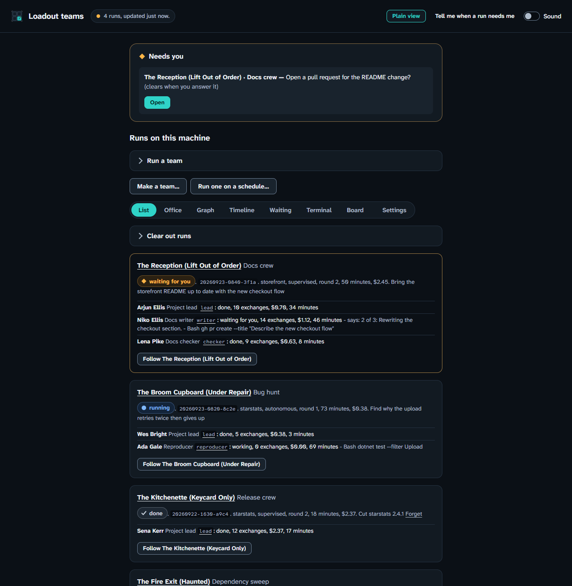

# Setting up accessibility

**At the end:** Loadout, the agent it starts and the dashboard all following
the way you've said you read, and you knowing which parts of that have been
checked.

## Before you start

- Loadout installed. See [installing](installing.md).
- Nothing else. Loadout detects nothing about you or your machine: you turn this
  on yourself, and nothing is guessed.

## Steps

### 1. Choose a preset

A preset is a starting point. It sets a bundle of settings, and anything you set
yourself wins over it. Presets are named for what they reduce, not for a
condition, because you shouldn't have to declare a diagnosis to get shorter
sentences.

| Preset | What it sets |
|---|---|
| `screen-reader` | No redraws, ASCII glyphs, lists instead of tables, numbered menus, the text launcher, no motion, the terminal bell, one question at a time |
| `low-vision` | Sixteen colours, reduced motion, bold-only emphasis, a summary first |
| `colour-blind` | Sixteen colours, and no red-and-green pairs |
| `dyslexia` | Sentences under twenty words, paragraphs of four, bold-only emphasis, one word per thing, numbered steps, plain language, a summary first |
| `adhd` | One question at a time with "question 2 of 4", a summary first, concise answers, confirmation before anything irreversible, reduced motion, no redraws |
| `plain-language` | Plain words, every question explained, one word per thing, and why it is being asked |

### 2. Try it on one command first

```sh
loadout team list --accessible
```

<!-- capture: docs/captures/team-list-accessible.txt — the same list under the screen-reader profile, one labelled line per value. -->

To try a particular preset, name it: `--accessible=dyslexia`.

You should see a first line naming the profile that's active. That line is how
you know it took. Under `screen-reader`, tables become one labelled line per
value and the output is ASCII only.

### 3. Or turn it on for this terminal

```sh
export LOADOUT_ACCESSIBLE=screen-reader
```

On Windows PowerShell:

```powershell
$env:LOADOUT_ACCESSIBLE = "screen-reader"
```

`1`, `true` and `yes` mean the screen-reader preset; `0`, `false` and `none`
mean off.

### 4. Turn it on for good

```sh
loadout config set accessibility-preset screen-reader
```

These three places are checked nearest first: the flag, then the environment
variable, then the setting. So a flag on one command always wins.

`NO_COLOR` is obeyed whatever the preset says, and switches off every escape
sequence, not only colour, because bold is an escape too.

### 5. Open the launcher

```sh
loadout
```

Under `screen-reader`, you should see a numbered text menu instead of the
full-screen launcher, answered by typing a number.

<!-- capture: docs/captures/text-launcher.txt — the text launcher, a numbered menu answered by number. -->

The text launcher is the tested path. Under the other presets you get the
full-screen launcher, drawn in the sixteen colours your terminal theme defines,
in ASCII where you asked for it, and without its opening animation where you
asked for less movement.

### 6. Check what the agent will be told

```sh
loadout loadout-cli --dry-run
```

Replace `loadout-cli` with your project's slug. The dry run says where the
compiled context went, and that context ends with a section saying how you
asked to be written to. It changes how things are said,
never what is done, and never what's quoted: a log line or an error is always
reproduced exactly.

When the session starts, Claude Code is started in its own screen-reader mode
where you asked for no redraws. Codex has its animations switched off; it has
no screen-reader mode, and Loadout says so at launch.

### 7. Open the dashboard

```sh
loadout team dashboard
```

Under `screen-reader` or `low-vision`, or with colour set to none, you get the
plain page.



A **Plain view** button is early in the tab order on every page, and the change
is announced in the page's live region. [Using the dashboard](dashboard.md)
covers the rest.

### 8. Turn on speech, only if you want it

Speech is off by default, and **stays off even under the `screen-reader`
preset**. To turn it on:

```sh
loadout config set show-speech screen-reader
```

With it on, the full-screen launcher says each row as the cursor lands on it,
the project's name first, so you can interrupt as soon as it's the wrong row.
The dashboard speaks its announcements too, but only when all four of these
hold: a screen reader answered rather than a system voice, `show-speech` is
`screen-reader`, the browser is on the same machine, and the request carries
the dashboard's token. The settings page says which one is missing. Nothing is
said that isn't also written on the page, and a line over 400 characters is
cut.

**Speech is built, and has been heard only through the Windows system voice,
never through a screen reader.** That's why it's off by default: offering it
unasked would be offering an unverified experience to exactly the people who
can't check it.

## What has been verified, and what hasn't

| | Status |
|---|---|
| Each preset produces the guidance, flags and settings it promises | Tested |
| Accessible output carries no escape sequences | Tested |
| Menus are numbered, and refuse a number outside the list | Tested |
| Dashboard: axe-core 4.10.2, fifteen states across both pages | No violations |
| Dashboard text contrast | 6.8:1 at worst in light, 9:1 in dark, against 4.5:1 required |
| All 48 dashboard theme, scheme and accent combinations | Pass, worst 5.2:1 |
| Dashboard speaking: the order in which it refuses | Tested against a stub, four mutations each failing its own test |
| Speech through the Windows system voice | The route answers |
| Speech through NVDA, or through `say` on macOS or speech-dispatcher on Linux | **Never heard** |
| Any screen reader, used with any of this | **Not tested** |
| A keyboard-only pass by a person | **Not recorded** |

If you use a screen reader, an issue saying what you heard is the most useful
thing you could send.

## If it went wrong

- **The first line doesn't name a profile.** Check for a flag or
  `LOADOUT_ACCESSIBLE` overriding the setting: the nearest one wins.
- **You hear nothing.** Speech is off unless you set `show-speech`. The
  dashboard's settings page names the condition that isn't met.

## What this doesn't do

- It doesn't detect anything. Nothing is turned on by guessing at your needs.
- It doesn't change either agent's colour theme, because which one you want
  can't be known from a profile.
- No dyslexia font and no readability score. Studies of dyslexia fonts find no
  gain, and a score measures sentence length, not understanding.

## Next

[Accessibility reference](../accessibility.md), for every setting on its own.
