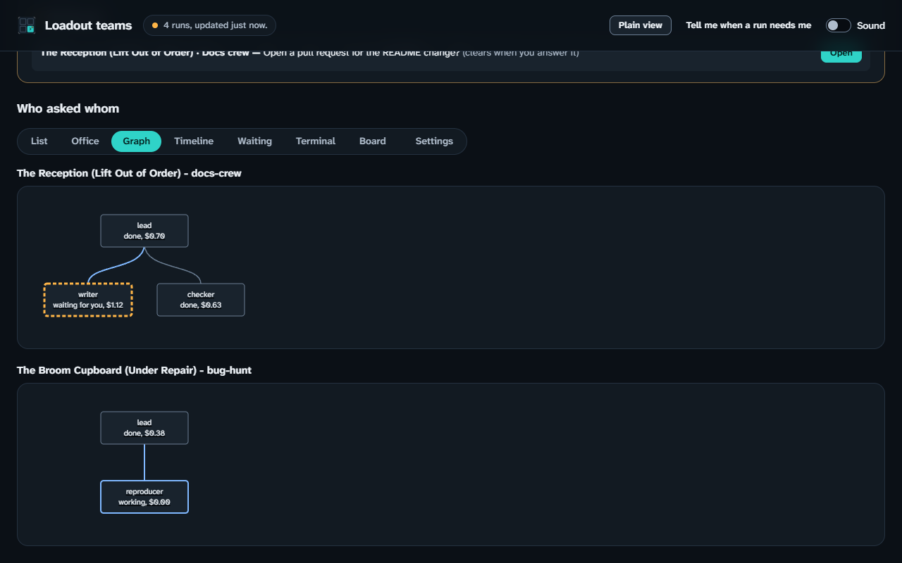
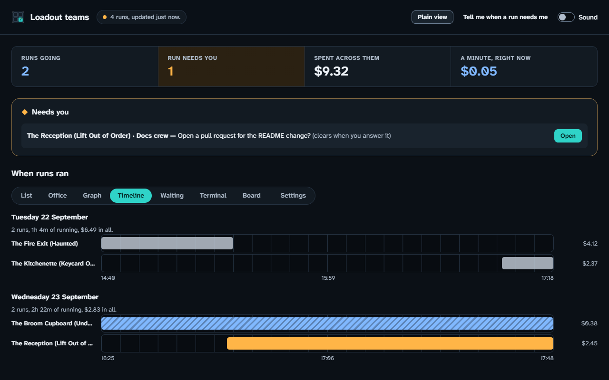
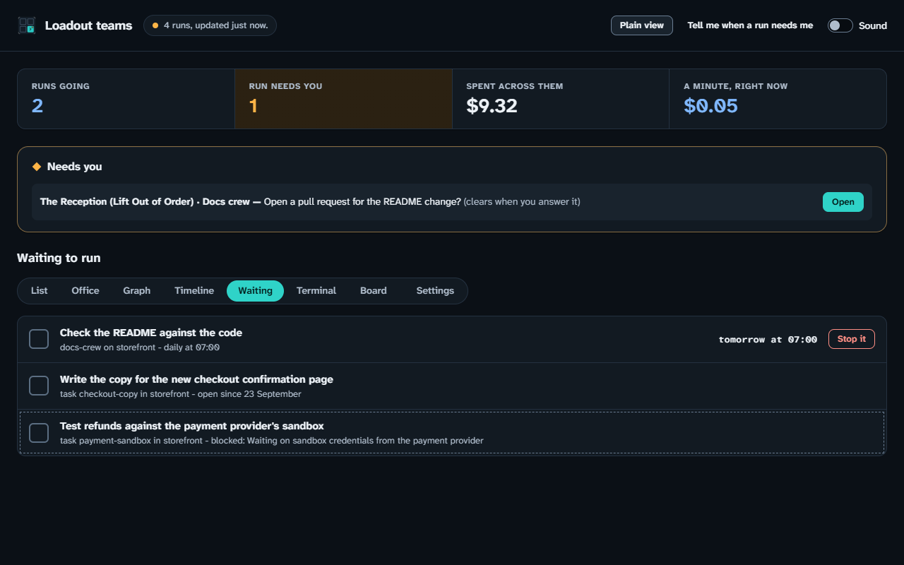
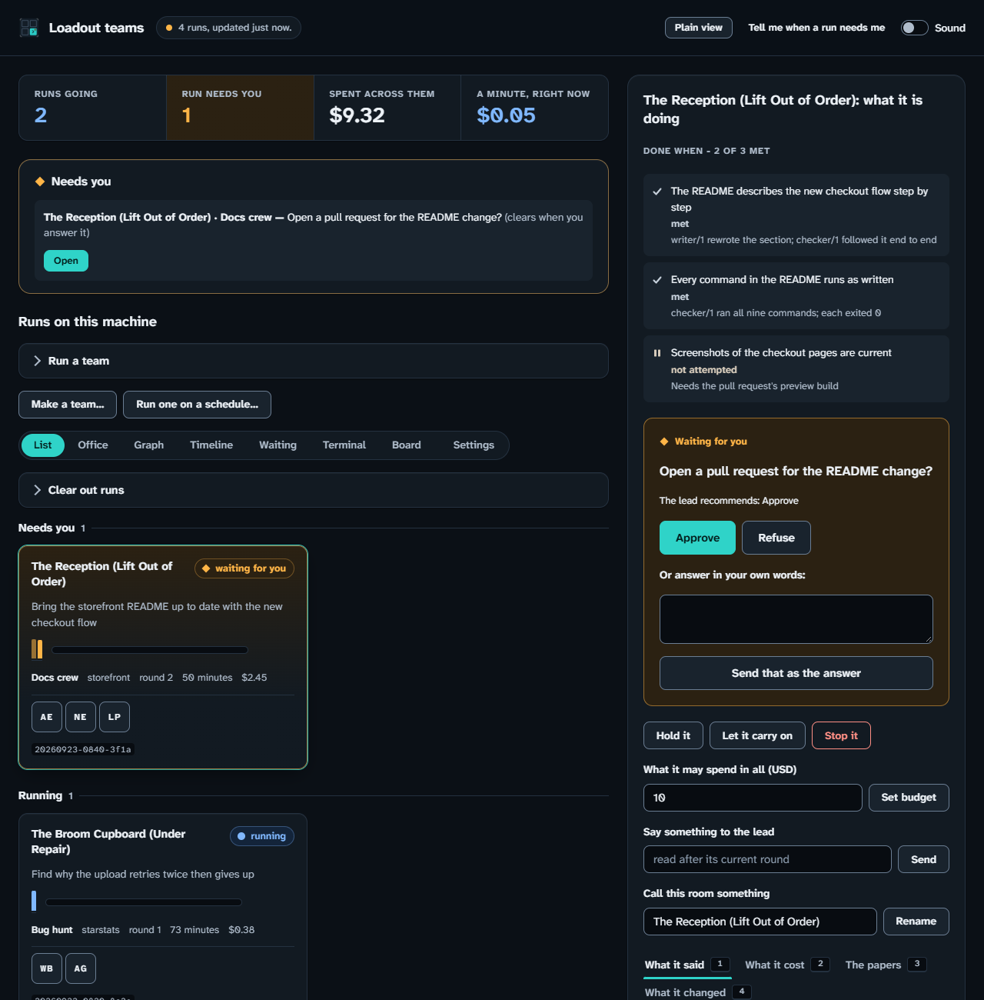
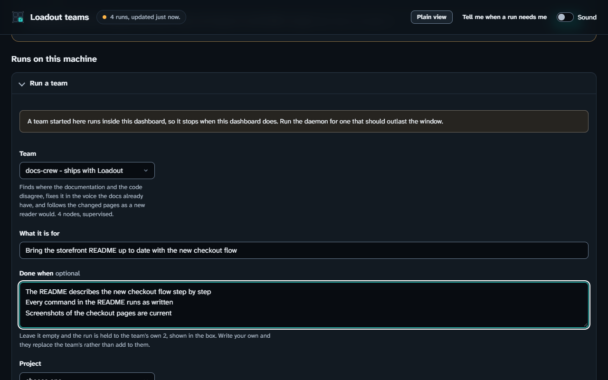
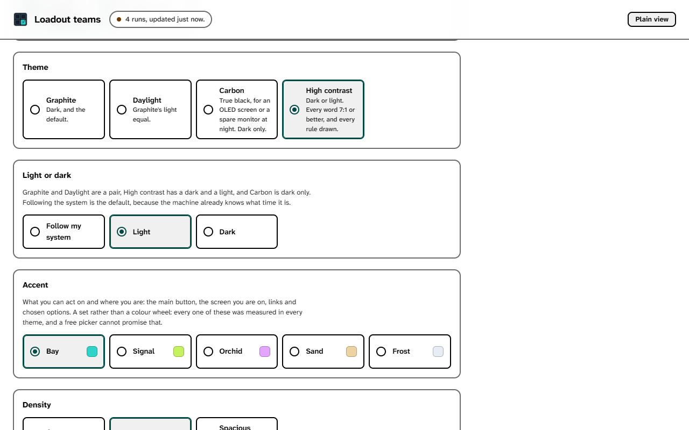

# Using the dashboard

**At the end:** the dashboard open in your browser, and you able to find a run,
answer what it's waiting on, and stop it.

## Before you start

- Loadout installed and a project registered. See [your first run](first-run.md).
- A team run to look at, or the intention to start one. See
  [running a team](teams.md).
- A browser on the same machine.

## Steps

### 1. Start the dashboard

```sh
loadout team dashboard
```

You should see the address it's serving on printed in the terminal. It's a
loopback address — only this machine can reach it — and it carries a token that
changes every time the dashboard starts, so an old link stops working.

If a Loadout daemon is already serving a dashboard, this command prints the
daemon's address instead and starts nothing, so you don't end up with two pages
over the same runs.

A team you start from this page runs inside this command, so it stops when you
close the terminal. The page tells you so above the form.

### 2. Open the address

Copy the whole address, token included, into your browser. Or start it with
`--open` to have it opened for you:

```sh
loadout team dashboard --open
```


You should see a band of totals across the top, then your runs grouped under
*Needs you*, *Running* and *Finished*. *Needs you* comes first because a run
waiting on you is the one most likely to be missed further down.

### 3. Choose plain or rich

Which page you get follows your accessibility profile. Under the
`screen-reader` or `low-vision` preset, or with colour set to none, you get the
plain page; otherwise the rich one. To choose for this start only:

```sh
loadout team dashboard --view plain
```


You can also press **Plain view** in the top bar of either page. It's early
in the tab order on purpose. `--view` doesn't override your motion setting:
asking for the rich page isn't asking for more movement.

### 4. Move between the screens

Across the top of the runs pane are six screens. The first four show the same
runs in different ways; *Waiting* shows what hasn't become a run yet, and
*Terminal* shows what a node is doing now.

- **List** — dense and complete. The default.
- **Office** — one room per run, a desk per node. The one to leave on a spare
  screen.

  

- **Graph** — who asked whom. Reach for it when something is stuck.

  

- **Timeline** — where the time and money went, a strip per day.

  

- **Waiting** — schedules that haven't fired and tasks nobody has finished.
  Anything held says what's holding it, in words.

  

- **Terminal** — a node's output, line by line, as it happens.

None of these screens can change anything. Every control lives in the detail
pane, so answering a gate is built once rather than several times.

Each screen has its own place in the address - `#office`, `#graph`, `#when`,
`#waiting`, `#terminal` - so you can bookmark one, and Back takes you to the
screen you were on before. Choosing a screen moves the keyboard focus to its
heading, which is also what a screen reader reads out.

### 5. Open a run and answer a gate

Select a run. It opens in the detail pane.



You should see its done-when criteria, each marked met, unmet or not attempted
in words, and any gate it's waiting on. A gate is a point where the run stops
and asks you before going on. Press **Approve** or **Refuse**.

Once the lead has reported, the goal is shown with what the lead took it to
mean, and each criterion with a **Taken to mean** line under it. Read the two
side by side: a run working hard on a nearby, easier goal looks on track until
you do.

A question from the lead has one more button than its options: **Think again**.
Use it when none of the options is right. The lead is told none was chosen, and
decides the thing itself or asks a better question.

The button runs the same command you could type yourself:

```sh
loadout team gate
```

That prints what the run is waiting on and how to answer it.

### 6. Start a team from the page

Press the button to start a team.



Choose a team, type the goal in your own words, and put one done-when criterion
per line. Criteria are one per line rather than comma-separated because a
criterion is a sentence, and sentences contain commas.

If the team has criteria of its own, the empty box shows them, and the run is
held to them unless you write your own — yours replace the team's.

**Take the lead's recommendation after** is for a run you won't be watching.
Put `30m` or `2h` and any question of the lead's that nobody answers in that
time takes its recommendation. Leave it empty and questions wait for you.

### 7. Stop or hold a run

From the detail pane, stop or hold the run. From a terminal it's:

```sh
loadout team halt --pause    # hold it before its next round
loadout team halt --resume
loadout team halt            # stop it after the round it is in
```

### 8. Change the look, if you want to

Open the settings page.



These change how this browser draws the page, and stay in this browser and
nowhere else.

- **Theme.** Graphite, the default, is dark; Daylight is its light
  equal; Carbon is true black, for an OLED screen or a spare monitor at night,
  and is dark only; High contrast has a dark and a light, with every word at
  7:1 or better and every rule drawn.
- **Light or dark.** Follow your system, which is the default, or pick one.
  It chooses between Graphite and Daylight, and between the two high-contrast
  themes.
- **Accent.** Bay, Signal, Orchid, Sand or Frost: the colour of what you can
  act on and where you are. A set rather than a colour picker, because each
  was measured in every theme.
- **Density.** Compact, Comfortable or Spacious.
- **Text size.** 100%, 112%, 125% or 150%. Everything grows with it, controls
  included, and your browser's zoom still works on top.
- **Reading.** Roomy spaces lines, letters and words further apart, and stops
  a run's goal being cut short on its card.
- **Focus ring.** Bold draws the ring round whatever the keyboard is on at 3
  pixels rather than 2. The high-contrast themes always draw it bold.
- **Movement.** As your profile and system say, or none at all. Your machine
  is asked as well and the quieter answer wins, so nothing here can bring back
  movement you turned down elsewhere.

A look chosen before this version, in the old Paper, Slate or Oxblood themes,
comes back as Graphite; High contrast stays High contrast; and every old accent
becomes Bay.

## Only watching

For a screen in a corner, start it so nothing on the page can change a run:

```sh
loadout team dashboard --watch-only
```

The server refuses anything that would start or change a run, and the page puts
its controls away rather than showing buttons that do nothing.

## If it went wrong

- **The page says the token is wrong.** The dashboard was restarted; copy the
  new address from the terminal.
- **The buttons are missing.** It was started with `--watch-only`.
- **The page is plain when you expected rich.** Your profile chose it. Use
  `--view rich` or the **Plain view** button.

## What this doesn't do

- It fetches nothing from the internet. Its typeface, Atkinson Hyperlegible,
  and the Loadout icon are carried inside the page. Office desks are drawn as
  rounded squares with names written under them, because Loadout ships no
  office art.
- Only the dashboard's own machine can reach it by default.
- No screen reader has been used with it, and no keyboard-only pass by a person
  has been recorded. [Setting up accessibility](accessibility.md) has what was
  checked.

## Next

[Running a team](teams.md)
