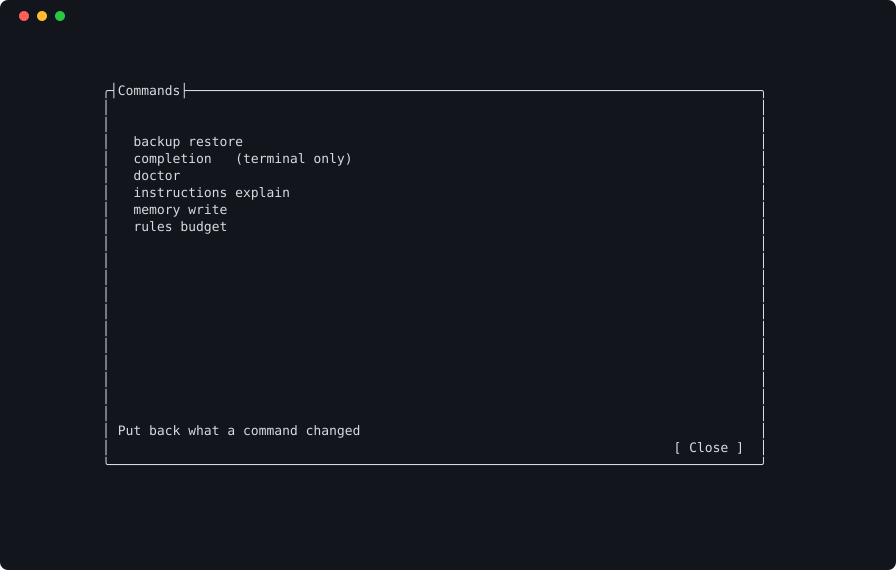
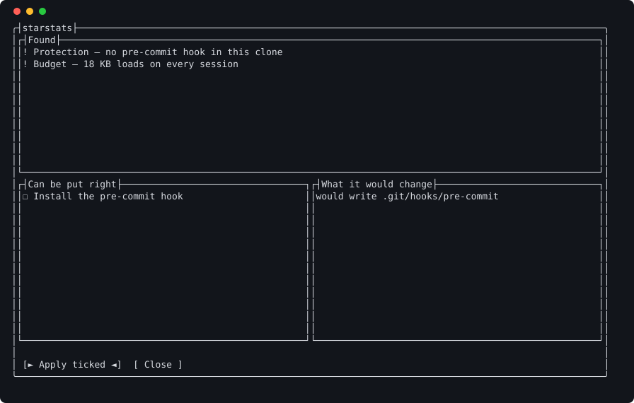

# Your first run

**At the end:** a workspace on this machine, one repository registered and
protected, and the launcher open with that repository in it.

## Before you start

- Loadout installed, and `loadout doctor` finding your agent. See
  [installing](installing.md).
- A Git repository you actually work in. A directory that isn't one yet can be
  registered too, and is marked as still to be set up.

## Steps

### 1. Set up the workspace

```sh
loadout setup
```

Setup asks where your workspace lives and which agent you use. The workspace is
where Loadout keeps everything your agent needs — instructions, rules, memory —
so that none of it has to live in your repository. You'll be offered three ways
to keep it:

1. Point at a workspace that already exists.
2. Create one. Take the Git-backed option if you work on more than one machine,
   because the workspace is what carries your instructions and memory between
   them.
3. Run with no central storage. This isn't a lesser mode: it lays out the same
   directories locally, so you can push them somewhere later.

It then checks Git is there, sets a Git identity if you have none (without one
every workspace commit fails with "Author identity unknown"), picks a secret
store that works on this machine, and offers to register the repositories it
finds in your development folders.

You'll know it worked when setup ends without an error and `loadout doctor`
reports the workspace.

### 2. Register a repository

Go to your repository and register it:

```sh
cd path/to/your/repository
loadout project add .
```

<!-- capture: docs/captures/project-add.txt — registering a repository under the slug storefront. -->

You should see the repository registered under a short name, its slug. The slug
is what `loadout <project>` takes and what memory and launch history are filed
under. If setup already registered it, this tells you so.

### 3. Protect it

```sh
loadout protect
```

This installs a pre-commit hook and Git excludes that stop agent files being
committed. Hooks live in `.git/hooks` and never travel with a clone, so a fresh
clone is unprotected — which is why a launch tells you when it is. It warns and
never blocks, because an unprotected repository may still be one you have good
reason to work in.

### 4. Open the launcher

```sh
loadout
```


You should see your projects on the left and, on the right, what a session in
the selected one would start with: its branch, whether the tree is clean, how
much instruction text loads whatever the task, and anything needing attention.
A row carries a mark only when something stops a launch — the repository isn't
on this machine, or its agent isn't installed.

### 5. Find anything with Ctrl+P

Press `Ctrl+P`.



You should see every command, grouped by what it's for. Type what you want to
do rather than a command's name: `undo` finds `backup restore`, `broken` finds
`doctor`. Press Esc to close it.

### 6. Look at anything that needs attention

If the right-hand panel lists something under *Needs attention*, open the
problems screen from the menu.



Each fix says what it would change. Space ticks one, Enter applies what's
ticked, and Esc backs out and changes nothing.

## If it went wrong

- **Setup says Git is missing.** Install Git and run `loadout setup` again.
- **Your project isn't in the list.** Run `loadout project add .` from inside
  it, or press `Ctrl+N` in the launcher.
- **The row is marked.** The detail pane says why: the repository isn't on this
  machine, or the agent it wants isn't installed. `loadout doctor` says more.

## What this doesn't do

- Registering a repository changes nothing inside it. `loadout protect` is the
  step that writes the hook, and only to `.git/hooks`.
- `protect` doesn't remove agent files already committed. `loadout migrate`
  moves those, shows you the change first and takes a snapshot you can restore.

## Next

[Launching a session](launching.md)
