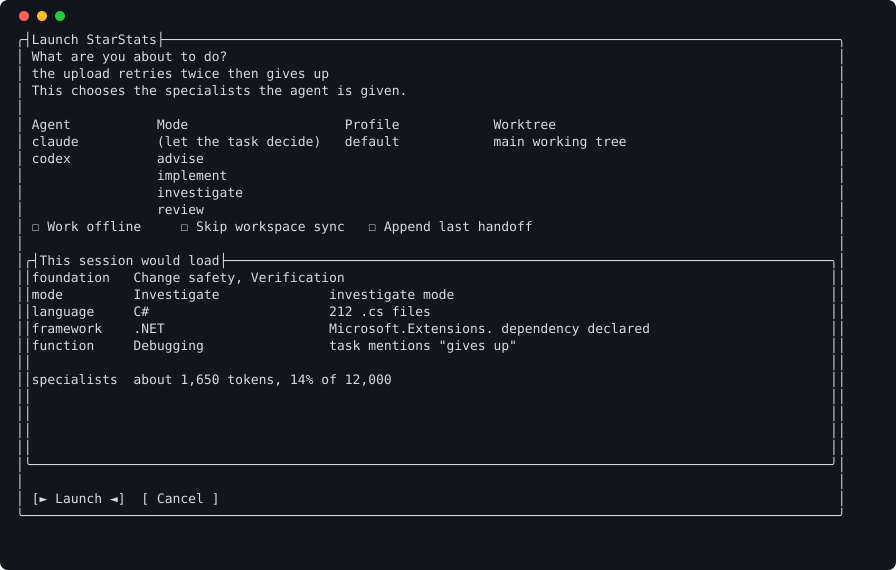

# Launching a session

**At the end:** a session started with the task and mode you chose, after
you've seen which instructions it gets and what they cost.

## Before you start

- A registered project. See [your first run](first-run.md).
- One sentence saying what you're about to do. "the upload retries twice then
  gives up" is a task; "work on the API" isn't, and won't reach anything the
  file extensions wouldn't have reached anyway.

## Steps

### 1. Open the launch sheet

Run `loadout`, move to your project and press Enter.

Enter doesn't start anything yet. It opens the launch sheet, with every question
already answered with the defaults. That one keystroke is what the preview
costs you.



You should see four choices — agent, task, mode, profile or worktree — and a
panel headed *This session would load*.

### 2. Check the task line

If the project has recorded what it's working on, the task line is already
filled in, and up to two other recorded tasks are named beneath it. That's
because a blank task line gets skipped: across 122 launches it was typed twice.
The line is editable text, so correct it rather than starting again. It's only
filled when it's empty, so anything you typed first is never overwritten.

If it's empty, type your sentence.

### 3. Choose the mode

The mode holds for the whole session. Choose the one that matches what you're
doing:

- `implement` — you've decided what to do. This is the default.
- `investigate` — you want to find out why something happens.
- `review` — you want a change looked at.
- `advise` — you want a recommendation, not a change.

The mode is never guessed from your wording. That matters: ask for a bug to be
investigated in `implement` and the investigation guidance doesn't load at all,
which is the commonest reason a session doesn't behave as somebody expected.

### 4. Read what the session would load

As you type the task or change the mode, the panel updates. You should see each
specialist it would load, why each was picked — "task mentions slow", "300 .cs
files" — and the total cost in tokens against the budget.

This isn't a separate preview. It's the resolver the launch itself uses, asked
early, so what it shows is what the session gets.

### 5. Launch

Press Enter on **Launch**. The agent starts with exactly what the panel showed.
Cancel instead and you're back at the list with nothing started.

## The same from the command line

Everything on the sheet is a flag:

```sh
loadout starstats --task "the upload retries twice then gives up" --mode investigate
```

To see the whole launch described without starting anything:

```sh
loadout starstats --dry-run
```

<!-- capture: docs/captures/launch-dry-run.txt — the caption says which agent the sandbox had, since output differs without one. -->

You should see the executable, the working directory, the compiled context and
where it went, the environment variables by name, the full command line, and
every specialist with its reason. Nothing is started.

## Comparing two ways of asking

Before you launch, you can see what a different task or mode would change:

```sh
loadout instructions explain "why is this postgres query so slow" \
    --mode investigate --against-task "add a retry to the upload step"
```

<!-- capture: docs/captures/instructions-explain.txt — which specialists a task would load, why, and the token cost against the budget. -->

You should see only the specialists that differ, the costliest first, and the
change in the total. [What you get](../features.md) has a full worked example.

## If it went wrong

- **The session didn't do what you expected.** Run
  `loadout instructions explain --project starstats "what you asked it to do"`
  first. Usually it never got the instruction you thought it had: the task
  didn't say enough, or the mode was wrong.
- **Launch is refused.** The detail pane and `loadout doctor` say why.

## What this doesn't do

- The token figure is an estimate of the instructions, not of the whole
  session. What the session then reads and writes is on top.
- It can't make a vague task specific. "work on the API" reaches nothing the
  file extensions wouldn't have reached anyway.

## Next

[Running a team](teams.md), when one session isn't enough.
