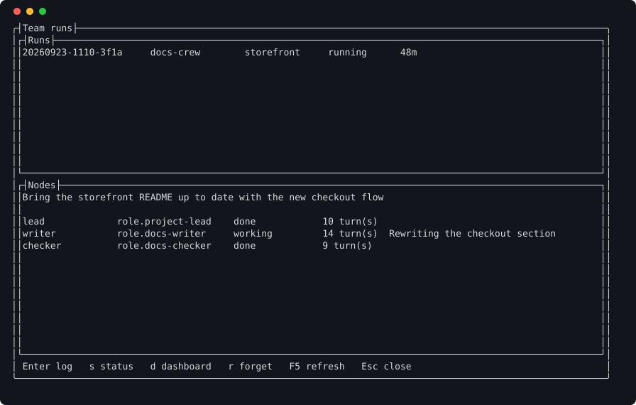

# Running a team

**At the end:** a team run started on a goal you wrote, held to criteria you
agreed, and a list of what it delivered.

## Before you start

- A registered project with your agent working in it. See
  [launching a session](launching.md).
- A goal a single session would struggle with. A team is for work that wants
  separate sessions — separate budgets, permissions and branches, and a record of
  who did what. For anything smaller, your agent's own subagents are cheaper.

## Steps

### 1. See which teams you have

```sh
loadout team list
```

The teams available on this machine.

```text
$ loadout team list
bug-hunt  5 node(s), supervised
  Reproduces a bug without a person watching, proves its cause, fixes the proven
cause, and proves the fix holds.
dependency-sweep  4 node(s), supervised
  Updates dependencies one branch per bump, in parallel, and verifies each with 
the suite green before it is offered for merge.
docs-crew  4 node(s), supervised
  Finds where the documentation and the code disagree, fixes it in the voice the
docs already have, and follows the changed pages as a new reader would.
iterating-project  5 node(s), supervised
  Plans, implements, reviews and verifies in rounds until the goal is met, the 
budget is spent, or two rounds make no progress.
marketing-studio  5 node(s), supervised
  Turns a goal into a strategy, writes the pieces, edits every claim against the
facts, and stages each send for you. Nothing is sent in any mode; your own copy 
may allow a named channel.
product-company  template  17 node(s), supervised
  A shape to copy, not a team to run. An executive lead splits a goal across 
department leads, each with its own workers. Deliberately shallow, because every
level between you and the work costs a session and loses part of the brief.
release-crew  4 node(s), supervised
  Checks the tree is fit to release, writes the notes for somebody deciding 
whether to update, and tags. The push is a gate in manual and supervised runs; 
an autonomous run may push the tag.
system-watch  6 node(s), supervised
  Investigates a system problem, proves the cause, fixes it, and turns the fix 
into something the team keeps and reuses.

Run one with: loadout team run <team> "<goal>"
```

You should see each team with where it came from: shipped, from a pack, or
written by you. `iterating-project` plans, implements, reviews and verifies in
rounds. `bug-hunt` reproduces a bug, proves its cause and fixes it.
`docs-crew` finds where the documentation and the code disagree. The
[teams reference](../teams.md) describes each one.

### 2. Look at one before you run it

```sh
loadout team show bug-hunt
```

You should see its nodes, their roles, the rules a run follows, its budget, and
anything that would stop it running here.

### 3. Start a run, saying what done means

```sh
loadout team run docs-crew "make the docs true" \
  --done-when "every command in docs/commands.md exists" \
  --done-when "the suite passes on a clean checkout" \
  --done-when "the changelog names the change"
```

Give `--done-when` once per criterion. Every node is told them, and the lead's
final report has to give a verdict on each: met, unmet or not attempted.

If you give none, the team's own apply, where its file gives some —
`team show docs-crew` lists them. Yours replace the team's rather than add to
them. If the team has none either, the lead proposes criteria and they're put in
front of you before any worker starts. Change them, accept them, or empty the
box to run with nothing checking it.

For a run you won't be watching, `--take-recommendation-after 30m` takes the
lead's recommendation on any of its questions that nobody has answered in that
time. It only applies to runs answered from the dashboard, and never to a merge
or anything that leaves your machine.

A run with no budget in its team file and no `--rounds` is refused before it
starts, naming both — without either, a lead that keeps asking for one more
thing would spend until somebody noticed. Every team that ships sets a budget.
To run with no money cap, say so: `--usd none` for the run, `usd: none` in the
team file, or `loadout config set team-budget none` for teams that set none.

### 4. Choose how much it asks you

`--autonomy` sets the posture:

- `supervised` — the default. The run goes on, and holds for you at the gates
  the team names.
- `manual` — asks you at every step. It refuses to start where nobody can
  answer, such as from a schedule.
- `autonomous` — holds for nothing, within its budget and permissions.

A team file can only set its outward gates — anything that leaves the machine —
to `ask`. What an autonomous run may push is agreed on this machine, not in the
team file, because the team file is shared and anybody can edit it.

### 5. Watch it

```sh
loadout team status
```

A team run's progress, with two of three criteria met, written as words.

```text
$ loadout team status
20260923-0840-3f1a  docs-crew  storefront  supervised  waiting for you  2 
round(s), 50m so far, $2.45

  waiting Open a pull request for the README change?
    loadout team gate 20260923-0840-3f1a --gate gate-5e1d9a20 --answer Approve
  Bring the storefront README up to date with the new checkout flow

  Done when 2 of 3 met
  + met           The README describes the new checkout flow step by step
      writer/1 rewrote the section; checker/1 followed it end to end
  + met           Every command in the README runs as written
      checker/1 ran all nine commands; each exited 0
  ? notattempted  Screenshots of the checkout pages are current
      Needs the pull request's preview build

  lead             role.project-lead      done               10 exchange(s)  $  
0.70  34m
  writer           role.docs-writer       waiting for you    14 exchange(s)  $  
1.12  46m
                   Bash gh pr create --title "Describe the new checkout flow"
                   says: 2 of 3: Rewriting the checkout section.
  checker          role.docs-checker      done                9 exchange(s)  $  
0.63  8m

journal: 
C:\Users\Public\example\AppData\Local\Loadout\teams\runs\20260923-0840-3f1a\jour
nal.jsonl
Read it with: loadout team log 20260923-0840-3f1a
```

You should see each node, what it's doing and what it has cost, and then the
criteria. For example, part way through a run:

```text
  Done when 2 of 3 met
  + met           every command in docs/commands.md exists
      docs-auditor/1 checked all 159
  + met           the suite passes
      verifier/1 reported 2843 passing
  ! not attempted the changelog mentions it
```

The same account is in the launcher under **Tools → Team runs…** and on the
[dashboard](dashboard.md). All three read one journal the run writes, so they
can't disagree.



### 6. Answer it when it asks

```sh
loadout team gate
```

You should see what the run is waiting on and the command to answer it. To
steer the lead without interrupting a node, send a message; it's read at the
start of the lead's next round:

```sh
loadout team message 20260918-1436-ed59 --message "leave the tests alone"
```

### 7. See what it delivered

```sh
loadout team outbox
```

You should see the commits the nodes reported, with the files inside each and
the node that made it, and a second block for anything written but not
committed, such as a plan.

## How a run stops

- The lead says it's done, and every criterion has a verdict.
- The budget is spent. A cap stops the run after the turn that crosses it,
  because an agent reports a turn's cost when the turn is over.
- Two rounds pass without progress.
- You stop it, with `loadout team halt`.

## If it went wrong

- **The run was refused.** Read the reason: usually no budget and no
  `--rounds` (give `--usd`, a figure or `none`, or `--rounds`), or an
  autonomous run asking for an outward action this machine hasn't agreed to.
- **A `done` was sent back.** A criterion was unmet or unanswered. The reason
  names it.
- **You want the detail.** `loadout team log --events` prints what happened —
  rounds, launches, asks, reports, gates — without every node's commentary.

## What this doesn't do

- It's not a second way to run an agent. Each node is an ordinary Loadout
  launch, with the same instructions and screening.
- With no criteria, "done" is the lead's word for it.
- An outward action a team file names does nothing until this machine agrees to
  it, with `loadout config set team-outward-allowed`. The
  [teams reference](../teams.md) has the detail.

## Next

[Using the dashboard](dashboard.md)
