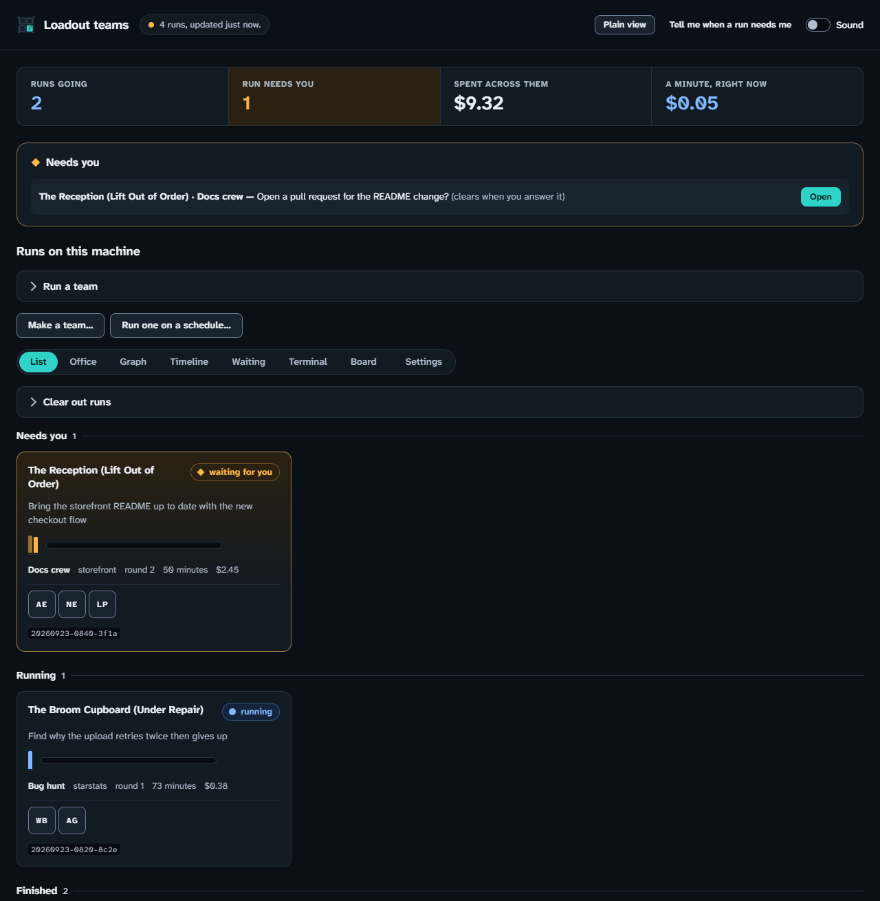

# Watching a team

**By the end of this page:** you'll have started a team, watched it in your web
browser, and know how to stop it.

## What a team is

A **team** is several coding agents working on one goal. One of them is the
**lead**. The lead splits your goal into jobs. The others, called **workers**,
each do a job. The lead reads what they did and decides what's next. At the
end, you get one report.

A team costs more than one agent, because several agents are working. So every
team has a **budget**: a limit on how much it may spend. When the budget runs
out, the team stops.

## Before you start

- You've done [your first launch](first-launch.md).

## Steps

### 1. See which teams you have

Type this in a terminal and press Enter:

```sh
loadout team list
```

You'll see a list of teams. Each one does a different kind of job. For example,
`bug-hunt` finds and fixes a fault in your code.

### 2. Start a team

Type `loadout team run`, the team's name, and your goal in quotation marks. Then
press Enter:

```sh
loadout team run bug-hunt "the settings file crashes the program when it is missing"
```

The lead may suggest what "done" should mean. It shows you a list. You can
change it, or accept it.

### 3. Open the dashboard

The **dashboard** is a web page that shows what your team is doing. In a new
terminal, type this and press Enter:

```sh
loadout team dashboard --open
```

Your web browser opens. Only your own computer can see this page.



You'll see your team's work on a card. The card says in words what state it's
in.

### 4. Answer when it asks

Sometimes a team stops and asks before doing something. This is called a
**gate**. It appears under the heading *Needs you*.

Open the card. Read the question. Press **Approve** or **Refuse**.

### 5. Stop it if you need to

Open the card and stop the run. Or type this in a terminal and press Enter:

```sh
loadout team halt
```

The team stops after the round it's in. A **round** is one pass of the lead
handing out jobs and reading the results.

### 6. See what it did

Type this and press Enter:

```sh
loadout team outbox
```

You'll see a list of the files the team changed, and which agent changed each
one.

## A team stops on its own when

- the lead says the goal is done
- the budget is spent
- two rounds pass with no progress

## If something went wrong

- **The team refused to start.** It has no budget and no limit on rounds. Read
  the message. It says what to add.
- **The dashboard page says the link is wrong.** The dashboard restarted. Copy
  the new address from the terminal.

## What this doesn't do

- If you empty the list of what "done" means, nothing checks the team's work.
  "Done" is then only the lead's word for it.
- Anything that leaves your computer, like publishing, waits for you to agree —
  unless you have told this computer in advance that it may.

## Next

[Using the dashboard](../guides/dashboard.md) has every screen, when you want
more detail.
